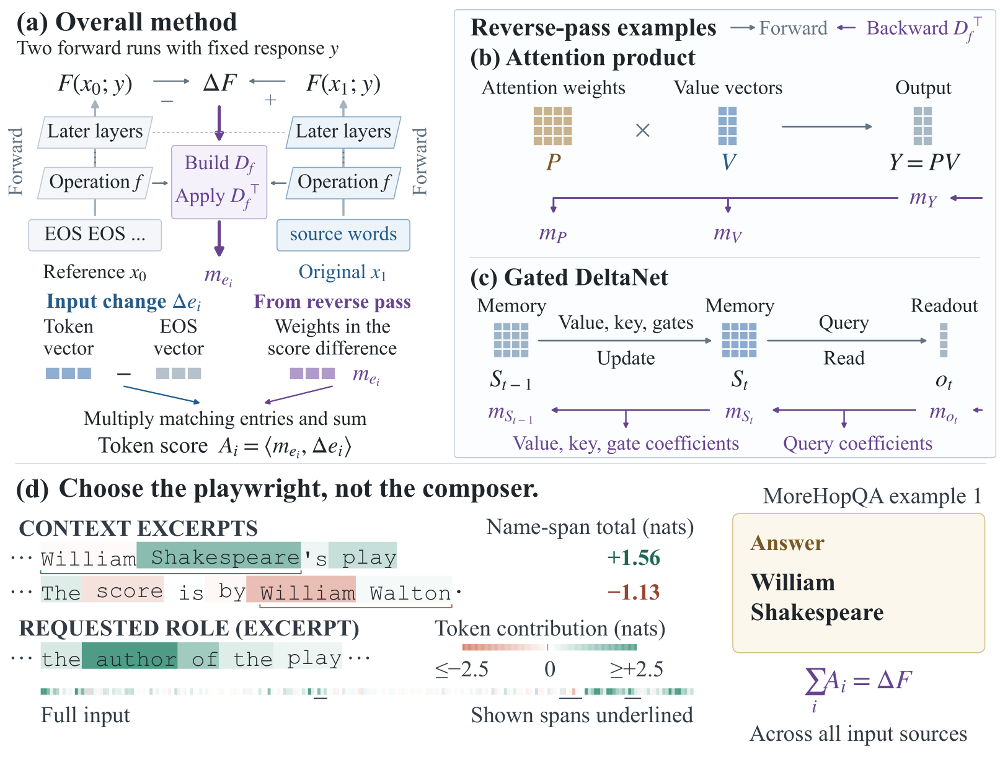
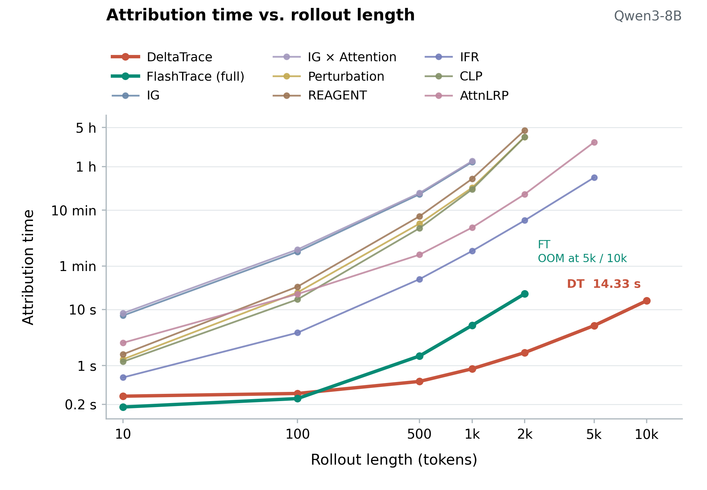
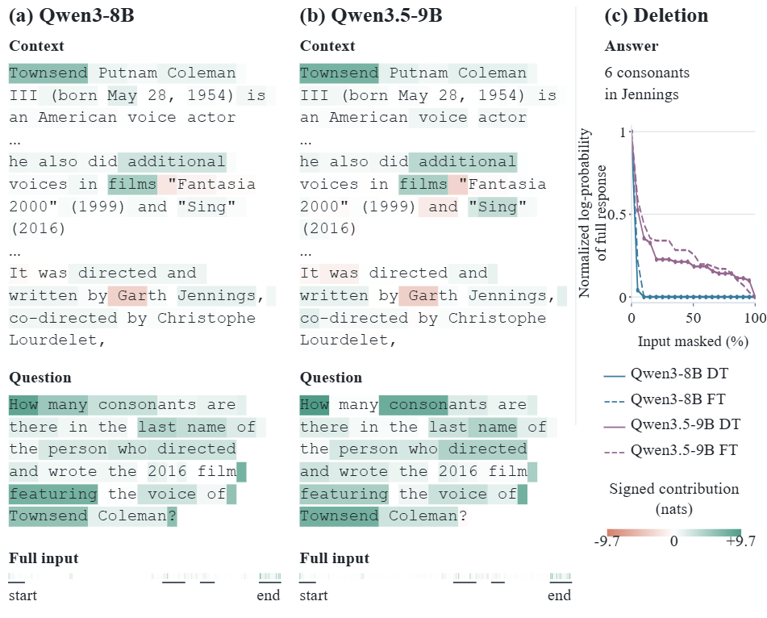

# DeltaTrace

**Efficient Signed Attribution for Reasoning Language Models**

[Paper](paper/iclr2027/output/pdf/deltatrace-iclr2027-draft.pdf) · [Results](paper/iclr2027/results/all_methods.csv) · [Method code](deltatrace/clean/) · [Reproducibility](#reproducibility)

DeltaTrace explains how an input contributes to a language model's complete reasoning response. It assigns signed credit to input tokens by tracing a finite change from a reference input to the original input through the model. The explanation follows both the evidence being carried and the attention or memory operations that determine how that evidence is used.

This repository contains the method implementation for **Qwen3-8B** and **Qwen3.5-9B**, evaluation records, measured efficiency results, and the editable manuscript with its figure and table sources.



## How it works

DeltaTrace compares two executions of the same model with the same fixed response:

1. **Define the response contrast.** Replace eligible source tokens with EOS to construct the reference input. Keep the stored reasoning, final answer, and terminal EOS fixed. The attribution target is the change in the log-likelihood of that entire response.
2. **Propagate the finite change.** Compose local finite propagation rules in one reverse traversal. Attention traces both transported values and changes in their selection. Gated delta memory traces retained content, writes, queries, keys, and gates.
3. **Read signed source contributions.** Project the propagated coefficients onto each input embedding difference. Contributions can be added across tokens to inspect a name, phrase, or passage.

For original input $x_1$, reference input $x_0$, and fixed response $y$, the target is

$$
\Delta F = \log p(y\mid x_1)-\log p(y\mid x_0).
$$

The finite chain rule gives $\sum_i A_i=\Delta F$ in exact arithmetic; implementation records also track numerical residuals. A positive score supports this response contrast, and a negative score opposes it. The sign is relative to the specified reference intervention; deleting one token from the original input defines a different intervention.

The implementation uses FlashAttention-style tiled propagation for dense attention and native Flash Linear Attention operations for gated delta memory. Auxiliary attribution storage grows linearly with sequence length at fixed model dimensions and chunk size. The operator rules and proofs are given in the [manuscript](paper/iclr2027/main.tex).

## Results

### Complete Qwen3-8B evaluation

The main comparison covers **1,243 examples across all 13 released tasks** from the FlashTrace `table1-data-v1` benchmark: ten RULER tasks with 100 examples each, HotpotQA with 48, MATH with 100, and MoreHopQA with 95. The released inputs and stored responses are retained without resampling or regeneration.

The tables compare **Perturbation, REAGENT, CLP, IFR, AttnLRP, FlashTrace (FT), and DeltaTrace (DT)**. Baseline numbers come from the published result CSVs; DeltaTrace results come from the frozen full-task run.

| Metric | DeltaTrace better than FT | DeltaTrace best among all seven methods |
| --- | ---: | ---: |
| RISE ↓ | 10 / 13 tasks | 9 / 13 tasks |
| MAS ↓ | 12 / 13 tasks | 11 / 13 tasks |
| Recovery@10% ↑ | 6 / 6 reported retrieval tasks | 6 / 6 reported retrieval tasks |

These counts compare observed task means. On the six reported retrieval tasks, recovery improves over FT by **3.96–19.60 percentage points**. RISE remains higher on MQ-Q4, MQ-Q8, and VT-H10-C1; MAS remains higher on MQ-Q8.

**Reporting scope:** RISE and MAS include all 13 tasks. Recovery is reported for the six multi-query and multi-value retrieval tasks. VT and HotpotQA recovery are omitted from the manuscript's selected scope; MATH and MoreHopQA have no released recovery measure. Full experiment records, including results outside that reporting scope, remain available in the [frozen evaluation snapshot](https://github.com/LceOmlet/DeltaTrace/tree/9c6497c08ac3ffa57a40189291644e5a6b99ee36/experiments/official/results/qwen3_8b_table1_20260909).

| Artifact | Contents |
| --- | --- |
| [Combined results CSV](paper/iclr2027/results/all_methods.csv) | All seven methods, full numeric precision, and explicit empty cells |
| [Manuscript tables](paper/iclr2027/results/full_table.tex) | Separate RISE, MAS, and recovery tables |
| [Result summary](paper/iclr2027/results/summary.json) | Task counts, development results, and measured cost summaries |
| [Source ledger](paper/iclr2027/results/sources.json) | Original records, selected fixtures, and SHA-256 hashes |
| [Published baseline ledger](paper/iclr2027/results/data/published_baseline_sources.json) | The 95 source CSVs and aggregation rows underlying the added baselines |

### Hybrid-model development results

Qwen3.5-9B is evaluated on a separate development set of eight MQ-Q2 and eight MoreHopQA examples, with FT run on the same model. Retrieval recovery rises from **63.92% to 73.35%**, and MAS is lower on both tasks. Signed RISE improves on MoreHopQA and remains higher on MQ-Q2. These 16 examples demonstrate the hybrid attention and memory implementation; they are separate from the complete Qwen3-8B benchmark.

The [development table](paper/iclr2027/results/development_table.tex) summarizes the 32 model–example pairs across the two models.

### Measured efficiency



The curve measures complete FT and DT evaluation wrappers on one C550; the other seven methods reuse the authors' released logs. The [experiment record](experiments/efficiency/README.md) includes the measurements, original data, and plotting script. Download the [vector curve](output/pdf/deltatrace-rollout-scaling.pdf) or inspect the [plotted data](experiments/efficiency/curve_data.csv).

The earlier [16-example implementation benchmark](paper/iclr2027/results/figures/deltatrace-efficiency.pdf) provides additional latency and memory measurements:

| Recorded comparison | Complete attribution time for 16 examples | Peak allocated memory |
| --- | ---: | ---: |
| Qwen3-8B: one-hop FT → tiled DT, sample batch 1 | 12.16 s → 11.40 s | 21.49 GB → 18.76 GB |
| Qwen3.5-9B: serial batch 1 with CPU checkpoints → real batch 2 with GPU checkpoints | 16.68 s → 12.33 s | 21.64 GB → 23.88 GB |

The Qwen3.5 configuration increases throughput by **35.3%** on the recorded 16-example workload. Each row is a separate paired implementation benchmark. The Qwen3 measurements predate the full-task quality freeze, and the Qwen3.5 comparison measures a scheduling and checkpointing change.

Times include input preparation, endpoint capture, layer replay, propagation, and returning scores. Model loading, shape warmup, and deletion scoring are measured separately. Memory is peak allocated device memory, including resident weights, in decimal GB. Real batch size counts examples; each example has two endpoints.

Additional [dense-versus-tiled measurements](paper/iclr2027/results/figures/deltatrace-tiling-cost.pdf) cover three recorded inputs of 1,241, 3,470, and 3,762 tokens. Later [replay-retention measurements](paper/iclr2027/results/retention_table.tex) reduce warm time by 5.80% on Qwen3 and 5.15% on Qwen3.5 against their respective baselines, with identical paired source vectors. The [measurement notes](paper/iclr2027/results/README.md) document the scope of each comparison.

## Inspect an explanation



Teal and coral mark positive and negative DeltaTrace contributions in nats. Both model panels use the same color scale within an example. The right panel compares each model's DT curve with its own one-hop FT baseline; its vertical axis is the **normalized log-likelihood of the full response**, including EOS. Normalization uses each model's full-input and fully-deleted scores, clipping, and the released cumulative-minimum transform. These illustrative DT curves use positive-score ranking; the main RISE tables use signed ranking.

The [figure collection](paper/iclr2027/output/pdf/deltatrace-figures.pdf) includes the mechanism overview, a two-number retrieval example, and this multi-hop example. Exact token scores and the recorded deletion points are stored in the [case fixture](paper/iclr2027/figures/data/cases.json).

## Reproducibility

### Rebuild tables, figures, and the paper on CPU

The manuscript's selected data and figure fixtures are included in `main`. Rebuilding them requires no model weights, accelerator, or new evaluation calls.

```bash
git clone --branch main https://github.com/LceOmlet/DeltaTrace.git
cd DeltaTrace

python -m venv .venv
source .venv/bin/activate
python -m pip install "numpy==1.26.4" "matplotlib==3.10.9" "pypdf==6.8.0"

python paper/iclr2027/results/build_results.py
python experiments/efficiency/build_curve.py
python paper/iclr2027/figures/build_figures.py
python paper/iclr2027/figures/check_case_layout.py
python paper/iclr2027/verify_source.py
```

Use Python 3.10–3.12 for this pinned artifact environment. On Windows, activate it with `.venv\Scripts\Activate.ps1`. The commands regenerate the tables and PDF/SVG/PNG figures from the included records, and check source hashes, case geometry, citations, and LaTeX input references.

With a TeX installation providing `latexmk` and `pdflatex`:

```bash
cd paper/iclr2027
latexmk -pdf -interaction=nonstopmode -halt-on-error -outdir=build main.tex
```

The rebuilt manuscript is `build/main.pdf`. The checked-in [reading copy](paper/iclr2027/output/pdf/deltatrace-iclr2027-draft.pdf) is 17 pages, with the main text ending on page 9. The [build receipt](paper/iclr2027/build_receipt.json) records the distributed PDF's hash and page review. Rebuilt files may differ in metadata or layout across library and TeX versions.

### Run model attribution and evaluation

Model execution uses a source-based research environment with compiled finite-propagation extensions. The complete Qwen3 run was recorded on a **MetaX C550 64 GB**, with Python 3.12, PyTorch `2.8.0+metax3.5.3.9`, Transformers `4.57.3`, vendor FlashAttention `2.6.3+metax3.5.3.9torch2.8`, and vendor Triton `3.0.0+metax3.5.3.9`. See the [environment receipt](paper/iclr2027/results/data/qwen3_environment.json) for the complete package and checkpoint identity.

The frozen method sources are in [`deltatrace/clean/`](deltatrace/clean/), version `clean-v1-20260909`:

| Model | Entry point | Configuration |
| --- | --- | --- |
| Qwen3-8B | [`propagate_paired_secant`](deltatrace/clean/qwen3/qwen_signed_secant_paired_vendor_fa.py) | FP16, `content_P1`, native model FlashAttention and a separate finite-propagation extension |
| Qwen3.5-9B | [`make_qwen35_clean_runner`](deltatrace/clean/qwen35/qwen35_clean_runner.py) | BF16, P1/content1 rules, native FA/FLA, and empty per-layer override maps |

The [method manifest](deltatrace/clean/sources.json) records all 27 frozen dependency files. Qwen3 and Qwen3.5 use their respective dependency environments and run in separate processes. Model weights and compiled libraries are supplied by the execution environment; their paths and identities are checked against an [environment manifest](experiments/official/environment.example.json).

For the full benchmark, use the **paper evaluation snapshot** below. It contains the signed-RISE adapter and task controller used for the reported results. The earlier adapter retained on `main` uses the original development positive-score view.

```bash
# From the repository root, check out the exact full-benchmark snapshot.
git fetch origin
git worktree add --detach ../DeltaTrace-table1 9c6497c08ac3ffa57a40189291644e5a6b99ee36
cd ../DeltaTrace-table1
```

Before running, prepare the local model checkpoint, compatible compiled finite library, and the original FlashTrace checkout at `075e7e44ae4d5acd2ed76e0d2aced57107d02736`. Place the released `table1-data-v1` caches in that checkout and fill in `experiments/official/environment.example.json` as an external environment file. The [release protocol](experiments/official/reference/REPRODUCTION.md) documents the cache layout; use its prepared responses for benchmark reproduction.

```bash
# In the configured Qwen3 execution environment: two-example execution check.
MACA_PATH=/opt/maca TRITON_ENABLE_PERSISTENT_AUTOTUNE_CONFIGS=0 \
python experiments/official/evaluate.py \
  --family qwen3 --environment /absolute/path/environment.json \
  --selection smoke --ft live --output /absolute/path/qwen3-smoke

# All 13 tasks, retaining the released examples and published FT results.
python experiments/official/run_qwen3_paper.py \
  --environment /absolute/path/environment.json \
  --output /absolute/path/qwen3-paper-run

# Validate and export a completed run.
python experiments/official/export_qwen3_paper.py \
  --run /absolute/path/qwen3-paper-run \
  --output /absolute/path/qwen3-paper-export
```

The task controller verifies completed tasks before reusing them when resuming. Per-example outputs include input identity, signed and positive attribution views, recorded deletion curves, metrics, and execution costs. Qwen3.5 development runs use `--family qwen35 --selection development16 --ft live` with the matching Qwen3.5 environment; published Qwen3 FT results are not used as its control.

### Experiment snapshots

| Record | Frozen source revision | Evidence |
| --- | --- | --- |
| Complete Qwen3-8B benchmark | [`9c6497c`](https://github.com/LceOmlet/DeltaTrace/tree/9c6497c08ac3ffa57a40189291644e5a6b99ee36) | [Full results, paired cases, and source audit](https://github.com/LceOmlet/DeltaTrace/tree/9c6497c08ac3ffa57a40189291644e5a6b99ee36/experiments/official/results/qwen3_8b_table1_20260909) |
| Qwen3.5 batching and GPU checkpoints | [`2b36c4e`](https://github.com/LceOmlet/DeltaTrace/tree/2b36c4ec74ebb0c317d2ec4b8e8da83941fea747) | [Paired warm-cost records](https://github.com/LceOmlet/DeltaTrace/tree/2b36c4ec74ebb0c317d2ec4b8e8da83941fea747/research/temporary/acceleration_20260909) |
| Replay retention | [`7fa54d2`](https://github.com/LceOmlet/DeltaTrace/tree/7fa54d2b340f47aace09c528361cb62febfc496c) | [Paired implementation measurements](https://github.com/LceOmlet/DeltaTrace/tree/7fa54d2b340f47aace09c528361cb62febfc496c/research/temporary/cause_tolerance_20260909) |

### Metric conventions

- **RISE:** rank the complete signed DeltaTrace contributions. Lower is better.
- **MAS and recovery:** use the positive part of the contributions. Recovery@10% measures the fraction of gold evidence in the top 10% of eligible input tokens.
- **Deletion scoring:** preserve the complete stored response plus EOS, use the released eager evaluator, and record 20 deletion steps plus the initial response point.
- **FT provenance:** full-task comparisons reuse the published CSVs and their matching `n1` traces. The separately executed development control uses one hop for faithfulness and three for recovery. The [source audit](https://github.com/LceOmlet/DeltaTrace/blob/9c6497c08ac3ffa57a40189291644e5a6b99ee36/experiments/official/results/qwen3_8b_table1_20260909/README.md) explains the difference between the published recovery traces and the upstream README's hop description.

The [results notes](paper/iclr2027/results/README.md) also document each baseline's aggregation row and perturbation variant. The experiment snapshots retain the original records, including task-level regressions and numerical differences between execution configurations.

## Repository layout

| Path | Purpose |
| --- | --- |
| [`deltatrace/clean/`](deltatrace/clean/) | Frozen method implementations and source manifest |
| [`experiments/official/`](experiments/official/) | Reference evaluation adapter, environment schema, original protocol, and baseline CSVs |
| [`paper/iclr2027/`](paper/iclr2027/) | Editable manuscript, official template, figures, and final PDFs |
| [`paper/iclr2027/results/`](paper/iclr2027/results/) | Selected result fixtures, baseline importer, and table/plot builder |
| [`evidence/`](evidence/) | Numeric evidence, source receipts, and export hashes |
| [`core/`](core/) | Earlier finite-rule implementations retained for comparison |
| [`research/`](research/) | Prototypes, execution utilities, and recorded development experiments |
| [`docs/history/`](docs/history/) | Historical analyses and implementation decisions |
| [`third_party/`](third_party/) | Pinned upstream sources and their licenses |

## Acknowledgments

The evaluation builds on [FlashTrace](https://github.com/wbopan/flashtrace/releases/tag/table1-data-v1), its released caches and baseline results, and the RULER, HotpotQA, MATH, and MoreHopQA tasks. Efficient execution builds on FlashAttention and Flash Linear Attention. Third-party source licenses and provenance are retained alongside the corresponding code; the manuscript's [bibliography](paper/iclr2027/references.bib) lists the research references.
