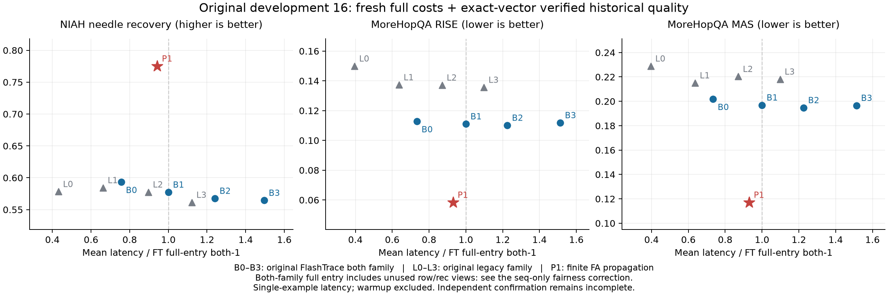

# FA有限P1与原FlashTrace的同次完整成本

本轮保持P1公式、真实模型FA和有限扩展不变，补齐全部原FT both0—3和legacy0—3各自独立计算的成本。使用原NI0—7、MH0—7开发样本；同一模型、FP16、固定响应及原可归因范围。FT运行作者原实现与eager配置，P1运行真实默认FA及明确标识的有限传播扩展；没有把FT换成自写近似实现。

后续已完成[原FT seq入口公平性修正](原FT_seq入口公平性修正_20260907.md)：本表both总入口包含未使用的row/rec视图。用作者原函数仅取相同seq后，FT更快，P1相对有效入口慢37.7%。下方0.928仅描述原完整API，不能当作算法效率胜出；保留原实测与预算上界作为该入口范围的记录。

每例9个方法各1次预热、3次轮转顺序实测；NI0另做P1和FTboth1完整profile。计时包含每次实际输入准备、端点前向、重放/传播、分数投影和CPU结果回传，不共享归因缓存。预热、profile和库初始化另列，不混入稳定耗时中位数。记录实际root输入，逐次核对FT为原输入、P1为真实EOS/原输入双端点。EOS取自检查点tokenizer配置和词表，源哈希匹配。

## 同次单样本延迟

这里是每个样本B1延迟；P1根调用的物理B2是两个端点，不是两个样本。真实B4吞吐证据另见先前批处理报告，不能互换。

|原样本|P1中位耗时|原FTboth1中位耗时|P1/FT1|P1峰值|FT1峰值|
|---|---:|---:|---:|---:|---:|
|niah_mq_q2 0|0.614s|0.673s|0.912|17.783GB|18.093GB|
|niah_mq_q2 1|0.971s|1.028s|0.944|18.697GB|21.311GB|
|niah_mq_q2 2|1.006s|1.064s|0.946|18.760GB|21.494GB|
|niah_mq_q2 3|0.589s|0.650s|0.905|17.749GB|18.037GB|
|niah_mq_q2 4|0.980s|0.978s|1.001|18.643GB|21.133GB|
|niah_mq_q2 5|0.988s|0.961s|1.029|18.722GB|21.353GB|
|niah_mq_q2 6|0.582s|0.738s|0.789|17.827GB|18.113GB|
|niah_mq_q2 7|1.014s|1.060s|0.957|18.717GB|21.329GB|
|morehopqa 0|0.782s|0.873s|0.896|18.578GB|19.240GB|
|morehopqa 1|0.434s|0.359s|1.209|17.251GB|17.349GB|
|morehopqa 2|0.642s|0.720s|0.893|17.875GB|18.588GB|
|morehopqa 3|0.708s|0.838s|0.844|18.063GB|18.794GB|
|morehopqa 4|0.630s|0.800s|0.788|18.667GB|18.665GB|
|morehopqa 5|0.460s|0.327s|1.405|17.323GB|17.314GB|
|morehopqa 6|0.478s|0.399s|1.197|17.507GB|17.510GB|
|morehopqa 7|0.519s|0.685s|0.758|17.602GB|17.854GB|

16例配对耗时比中位数0.9280。仍慢于FTboth1的样本：[['niah_mq_q2', 4], ['niah_mq_q2', 5], ['morehopqa', 1], ['morehopqa', 5], ['morehopqa', 6]]。保留全部3次实测和冷启动，不删异常高值来制造优势。峰值含模型权重，GB按十进制。该比较不能证明每条输入、任意模型或任意设备均不退化。

首例冷启动计时：P1为19.035s，FTboth1为0.700s。16例P1预热累计30.071s，包含实际首次编译/准备，不计入上述稳定运行中位数，但仍属于本轮真实成本。

## 原质量与相同延迟预算

本轮新增质量查询为0。先前完整原曲线已经独立核验；只有本轮预定repeat1的完整投影向量与原记录完全一致，才允许关联原指标。该条件用于证明缓存可复用，不是要求FA优化必须逐位相同；有不同就需要新原曲线。原质量使用作者完整固定响应含EOS的评分，作者seq_attr视图也是对全部生成行聚合；P1账本/符号另用同一数学目标的G32，不冒充原低精度指标。

|数据集|方法|均值耗时|原恢复率|原RISE|原MAS|
|---|---|---:|---:|---:|---:|
|niah_mq_q2|finite|0.843s|0.775200|0.057362|0.080624|
|niah_mq_q2|both_0|0.677s|0.593272|0.062142|0.152447|
|niah_mq_q2|both_1|0.894s|0.577331|0.068450|0.154651|
|niah_mq_q2|both_2|1.110s|0.567631|0.068643|0.154145|
|niah_mq_q2|both_3|1.338s|0.564506|0.070766|0.155493|
|niah_mq_q2|legacy_0|0.386s|0.578260|0.061934|0.148455|
|niah_mq_q2|legacy_1|0.592s|0.584341|0.066609|0.153237|
|niah_mq_q2|legacy_2|0.801s|0.577593|0.067096|0.152623|
|niah_mq_q2|legacy_3|1.003s|0.561381|0.069232|0.154129|
|morehopqa|finite|0.582s|不适用|0.058391|0.117102|
|morehopqa|both_0|0.459s|不适用|0.112804|0.201860|
|morehopqa|both_1|0.625s|不适用|0.111074|0.196903|
|morehopqa|both_2|0.766s|不适用|0.110126|0.194725|
|morehopqa|both_3|0.946s|不适用|0.111860|0.196601|
|morehopqa|legacy_0|0.247s|不适用|0.149909|0.228864|
|morehopqa|legacy_1|0.398s|不适用|0.137327|0.215059|
|morehopqa|legacy_2|0.545s|不适用|0.137131|0.220296|
|morehopqa|legacy_3|0.687s|不适用|0.135623|0.218146|

原指标复用条件满足144/144个样本—方法组合；原曲线和来源哈希在摘要中逐项保存。这是开发质量的同次成本补充，不是新独立确认。恢复率越高越好，RISE/MAS越低越好；不把RISE/MAS当作负向符号正确率。

还按每例P1实际中位延迟筛出预算内的FT变体，再分别取质量最优者，得到严格的事后预算对照上界。它知道每例评测结果，所以不是可部署的FT选择器，不能隐瞒这一额外信息。逐例预算、所选变体、配对差及未获得可比较指标的样本全部保存。

niah_mq_q2：rise的P1减预算内最优FT均值差=0.004475（8例）；mas的P1减预算内最优FT均值差=-0.064723（8例）；recovery的P1减预算内最优FT均值差=0.155341（8例）；

morehopqa：rise的P1减预算内最优FT均值差=-0.048738（8例）；mas的P1减预算内最优FT均值差=-0.059559（8例）；

实际合计578次独立归因：65次P1（含profile）、513次FT；根前向578次，P1根端点轨迹130条，FT轨迹513条；额外原层重放2,340次（4,680条端点层轨迹）、额外原FA调用2,340次、有限算子2,340次（每次3个内核）；0次原生VJP、0次原质量查询。库初始化0.001s；全部归因计时合计434.598s；完整作业2452.914s，含重复写审查产物、加载/核验检查点等，不能把这个总时间当作生产归因延迟。首次profile中实际内核与逐次调用数均单独核验。

## 独立确认与连续决策

新的MoreHopQA采样脚本、首256条未重叠来源和协议已部署，实际服务器预检验证源哈希，尚缺qwen3-235b-a22b-2507与deepseek-v3-1-terminus的API base及安全凭据加载配置。实际API调用0；不私自替换原生成或评判模型。

身份审查补充确认：NIAH q2第8—15条也出现在历史VJP实验记录中，prompt/target哈希与作者缓存匹配。虽然历史目录名带100ex，现存manifest实际只有28条，不能按目录名当作100条完成；但与后续经核验的16—31和32—99结果合并后，q2的100条均有使用证据。Morehop95条同样全部已用。这项审查只证明历史使用，不采信旧VJP质量或实现，不把它们重新归类为新确认数据。

下一步保持P1这一质量候选，优先验证真实B4在全部16条开发输入上的成本与原指标，并为新确认集固定批处理安排。NIAH独立来源需要从作者其他原任务/原流程核对并冻结，不能继续使用q2历史缓存冒充独立确认。随后使用新来源做当前候选与全部原FT对照的独立比较，不根据确认结果调参。

负向符号仍有实质边界：刚完成的条件诊断中NI强负分与原输入删除同号仅30/64，384个所选token中201个随两种背景反号。当前P1分配不等于普遍删除方向；成本改善不能替代符号和独立质量验证。研究目标未完成。

证据：finite_FA_FT_cost16_summary_20260907.json、finite_FA_FT_cost16_numeric_20260907.json、原冻结study/协议/核验脚本、original_morehop_sampler_preflight_20260907.json和original_cache_exposure_summary_20260907.json。原成本结果SHA256：f0bf315cbe7422bc5827182eb12905b545f2b34356cddcf0e33af39ac69ec679。

## 实验记录的额外开销

本轮完整作业40.88分钟，而归因分段计时合计7.24分钟；不能把两者混为模型延迟。为了定位可消除的测试开销，作业结束后对真实最终结果做一次同机标准JSON写入比较，0次模型/GPU调用：缩进版108.42MB、编码加原子写入2.641s；紧凑版30.72MB、0.442s。两种解码后的全部数据完全一致，原结果文件哈希保持不变，并在本地独立重建两种编码的完整字节哈希。

单次最终记录的序列化约快5.98倍，证明后续实验可以直接复用标准json的紧凑编码减少保存开销；未实测每次历史保存，不能将全部33.64分钟差额都归因于JSON。下一份批处理实验应将这一写法在冻结源码前接入，同时保留所有数组、调用与曲线；本轮已冻结study和原结果不追溯改写。这是审查记录开销优化，不是归因算子加速。
