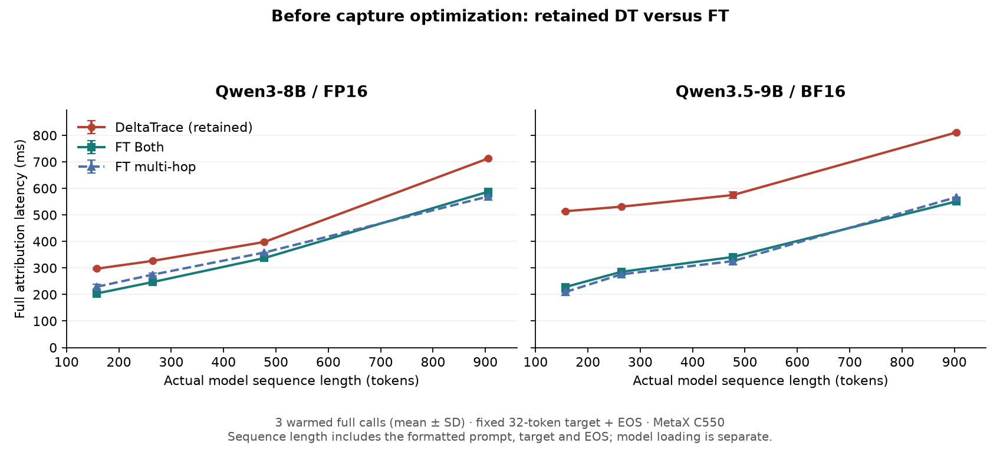
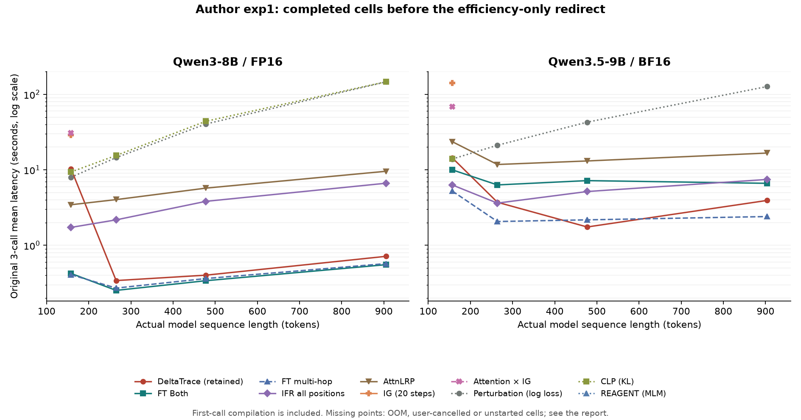
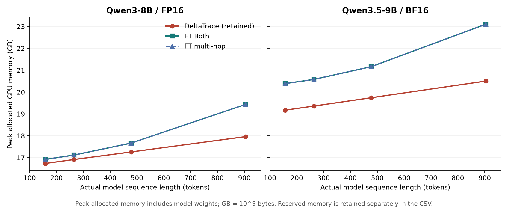

# 作者 exp1：单样本、短输入、多方法效率测试

优化前的 retained DT 在这次两模型、四档短输入测试中均慢于 FT。相同输入下，DT 的峰值已分配显存较低；速度与显存结论分别报告。本报告只记录加速前基线；后续实现和验收见 [监听开销优化](CODE_LOCAL_CAPTURE.md)。没有进行归因质量、Qwen自由回答生成或 RISE/MAS 测试。

用户随后要求专心做效率优化，剩余慢基线已立即停止：Qwen3.5 CLP 保留中途记录，两模型 REAGENT 的依赖恢复后运行未启动。DT/FT 核心对比已经完整完成，下面的其他方法表明确保留未完成单元。

## 预热后的完整调用

每格为额外三次预热调用的均值，单位 ms；使用作者同步 CUDA 的 `measure`，计入完整归因计算及返回对象销毁，模型加载和归因器构造在计时外。原三次调用与这三次额外调用均执行作者的显存清理。

| 模型 | 目标输入档 | 实际总序列 | DT | FT Both | FT multi-hop | DT 相对 FT Both |
|---|---:|---:|---:|---:|---:|---:|
| Qwen3-8B | 128 | 158 | 297.4 | 204.0 | 229.2 | +45.7% |
| Qwen3-8B | 256 | 265 | 326.9 | 247.1 | 275.0 | +32.3% |
| Qwen3-8B | 512 | 478 | 398.0 | 337.5 | 358.3 | +18.0% |
| Qwen3-8B | 1024 | 905 | 712.7 | 587.3 | 569.4 | +21.4% |
| Qwen3.5-9B | 128 | 157 | 514.0 | 228.2 | 209.3 | +125.2% |
| Qwen3.5-9B | 256 | 264 | 531.1 | 285.6 | 276.2 | +85.9% |
| Qwen3.5-9B | 512 | 477 | 575.0 | 341.4 | 325.9 | +68.4% |
| Qwen3.5-9B | 1024 | 904 | 811.2 | 551.0 | 567.0 | +47.2% |

## 作者原三次重复：已完成与中断记录

下表保留作者原始三次重复的均值 ± 总体标准差，单位秒。包含每个方法进程的首次调用，因此最短档可能包含编译/延迟初始化成本，不能拿这一表的首次 DT 均值当成稳定延迟。`OOM` 表示按作者默认参数显存不足；失败格不填伪造耗时，也不临时改变步数或内部批量。

### Qwen3-8B / FP16

| 方法 | 128 | 256 | 512 | 1024 |
|---|---:|---:|---:|---:|
| DT retained | 10.301 ± 14.151 | 0.341 ± 0.018 | 0.402 ± 0.003 | 0.714 ± 0.003 |
| FT Both | 0.424 ± 0.314 | 0.253 ± 0.003 | 0.340 ± 0.004 | 0.554 ± 0.002 |
| FT multi-hop | 0.407 ± 0.307 | 0.271 ± 0.004 | 0.363 ± 0.003 | 0.572 ± 0.004 |
| IFR all positions | 1.727 ± 0.325 | 2.173 ± 0.006 | 3.824 ± 0.113 | 6.643 ± 0.052 |
| AttnLRP | 3.447 ± 0.311 | 4.032 ± 0.011 | 5.723 ± 0.045 | 9.570 ± 0.035 |
| IG (20 steps) | 28.716 ± 0.422 | OOM | OOM | OOM |
| Attention × IG | 30.686 ± 0.400 | OOM | OOM | OOM |
| Perturbation (log loss) | 7.982 ± 1.298 | 14.501 ± 0.094 | 40.533 ± 0.090 | 146.233 ± 1.152 |
| CLP (KL) | 9.370 ± 0.309 | 15.501 ± 0.917 | 44.047 ± 0.353 | 146.809 ± 1.231 |
| REAGENT (MLM) | 未完成 | 未完成 | 未完成 | 未完成 |

### Qwen3.5-9B / BF16

| 方法 | 128 | 256 | 512 | 1024 |
|---|---:|---:|---:|---:|
| DT retained | 14.415 ± 19.661 | 3.718 ± 4.515 | 1.749 ± 1.652 | 3.933 ± 4.416 |
| FT Both | 9.997 ± 13.814 | 6.309 ± 8.489 | 7.199 ± 9.681 | 6.625 ± 8.588 |
| FT multi-hop | 5.237 ± 7.109 | 2.067 ± 2.541 | 2.174 ± 2.611 | 2.404 ± 2.651 |
| IFR all positions | 6.302 ± 7.038 | 3.623 ± 2.524 | 5.158 ± 2.554 | 7.461 ± 2.586 |
| AttnLRP | 23.607 ± 27.747 | 11.769 ± 9.691 | 13.108 ± 9.660 | 16.686 ± 9.794 |
| IG (20 steps) | 140.809 ± 154.989 | OOM | OOM | OOM |
| Attention × IG | 68.320 ± 49.673 | OOM | OOM | OOM |
| Perturbation (log loss) | 13.904 ± 5.976 | 21.164 ± 2.397 | 42.838 ± 1.000 | 127.017 ± 3.090 |
| CLP (KL) | 14.029 ± 6.110 | 未完成 | 未完成 | 未完成 |
| REAGENT (MLM) | 未完成 | 未完成 | 未完成 | 未完成 |

## 显存与首次调用

显存单位为作者使用的十进制 GB（10⁹ bytes），峰值包含模型权重。下表是预热三次调用中的最大已分配显存；保留显存另存 CSV。

| 模型 | 目标输入档 | DT GB | FT Both GB | DT 减少 GB |
|---|---:|---:|---:|---:|
| qwen3 | 128 | 16.734 | 16.919 | 0.185 |
| qwen3 | 256 | 16.915 | 17.118 | 0.203 |
| qwen3 | 512 | 17.261 | 17.665 | 0.404 |
| qwen3 | 1024 | 17.963 | 19.437 | 1.474 |
| qwen35 | 128 | 19.172 | 20.389 | 1.217 |
| qwen35 | 256 | 19.361 | 20.579 | 1.218 |
| qwen35 | 512 | 19.741 | 21.160 | 1.419 |
| qwen35 | 1024 | 20.503 | 23.100 | 2.598 |

| 模型 | 方法 | 模型加载秒 | 单独原生初始化秒 | 进程内首次调用秒 |
|---|---|---:|---:|---:|
| qwen35 | DT retained | 9.333 | 20.888 | 42.220 |
| qwen35 | FT Both | 9.231 | 0.000 | 29.533 |
| qwen35 | FT multi-hop | 9.146 | 0.000 | 15.291 |
| qwen3 | DT retained | 7.704 | 0.000 | 30.313 |
| qwen3 | FT multi-hop | 7.978 | 0.000 | 0.841 |
| qwen3 | FT Both | 8.090 | 0.000 | 0.868 |

这里的“首次”指该方法进程内首次调用。同模型各方法共享磁盘上的原生/Inductor 编译缓存，且 Qwen3.5 DT 有单独记账的原生 eager 延迟初始化；这不是各方法各自清空磁盘缓存的冷启动竞赛。每次归因器构造耗时在原始行的 `runner_init_seconds` 中完整保留。

## 协议、实际输入与边界

- 复用作者提交 `075e7e44ae4d5acd2ed76e0d2aced57107d02736` 的 `exp/exp1/run_time_curve.py`，SHA256 为 `e073abadeb20df0fedcfd55acd0061489d0f51813bc8c1486e28ca42c2b28951`。输入/目标构造、计时、清理、IG 20 步和 FT chunk 128 / sink 32 来自原入口；IFR all positions 使用原 sink chunk 1。
- 作者默认八种方法，加上同一原入口已经支持的 FT Both 和当前 DT retained。每种方法单独加载模型、串行使用同一 MetaX C550；这是本次显式扩展。Qwen3 使用原入口；Qwen3.5 使用固定官方扩展 `e81b3be50a48dcfc652fbf1b530069b552736e66` 的对应类。
- 样本批量为 1；DT 的两个端点组成内部 B2。IG 沿积分路径的内部批量仍按作者公式计算并由 IG 上限 20 截断，不能等同于 20 个独立样本。
- 目标输入档为 128、256、512、1024，输出固定为作者 32-token 构造再加 EOS。原构造会 decode/re-tokenize，档名不是实际模型 token 数。实际完整序列均不超过 1k，见下表。
- 默认 RULER 文件缺失，使用作者原代码内置的 `RULER fallback text. `。目标也使用作者固定合成文本。两模型和全部方法保存完整 token IDs；同模型各方法的输入/目标哈希相同。该合成短输入实验不代表真实任务上的归因质量或其他输出长度的速度。

| 模型 | 目标输入档 | 实际用户输入 | 格式化 prompt | 目标含 EOS | 实际完整序列 |
|---|---:|---:|---:|---:|---:|
| qwen3 | 128 | 107 | 125 | 33 | 158 |
| qwen3 | 256 | 214 | 232 | 33 | 265 |
| qwen3 | 512 | 427 | 445 | 33 | 478 |
| qwen3 | 1024 | 854 | 872 | 33 | 905 |
| qwen35 | 128 | 107 | 124 | 33 | 157 |
| qwen35 | 256 | 214 | 231 | 33 | 264 |
| qwen35 | 512 | 427 | 444 | 33 | 477 |
| qwen35 | 1024 | 854 | 871 | 33 | 904 |

每个成功格另有一次单独记账的输出/原生根输入观察调用；计时调用不挂这些观察器。DT、两种FT及IFR all positions的原生根输入与预期token IDs核对；其他方法保存能观察到的input_ids调用。IG可经inputs_embeds执行，现有观察器不捕获该输入，不能把构造器token一致性说成验证了每次插值/扰动的原生输入。DT 要求原始向量有限；FT、IG、LRP 原矩阵的 NaN 包含作者刻意保留的可视化占位，核验使用作者公开归一化的 NaN→0、非负截断及逐行归一化语义，原 NPZ 完整保留。Infinity 不作为合法占位。

## 环境恢复与失败记录

本轮服务器重建后恢复既有字节固定的模型环境、有限核和官方源文件。最初两次 Qwen3.5 FT 运行缺少先前已使用的 FLA 原生兼容文件，后续补齐并在模型加载前增加来源哈希门槛。三个扰动方法最初缺少其原始 Longformer 依赖；随后从官方 `allenai/longformer-base-4096` 固定 revision `301e6a42cb0d9976a6d6a26a079fef81c18aa895` 下载、验证并上传真实权重，再运行原入口。原始失败记录仍保留，只有这八次环境不完整尝试从方法对比中显式排除。

- `qwen35_ifr_multi_hop/results.json`：24/24 失败；Initial environment omitted already accepted native FLA compatibility sources; superseded by hash-gated v2.
- `qwen35_ifr_multi_hop_both/results.json`：24/24 失败；Initial environment omitted already accepted native FLA compatibility sources; superseded by hash-gated v2.
- `qwen35_perturbation_all_v2/results.json`：12/12 失败；Original auxiliary Longformer dependency absent. Dependency was restored; later runs or user cancellation are retained separately.
- `qwen35_perturbation_CLP_v2/results.json`：12/12 失败；Original auxiliary Longformer dependency absent. Dependency was restored; later runs or user cancellation are retained separately.
- `qwen35_perturbation_REAGENT_v2/results.json`：12/12 失败；Original auxiliary Longformer dependency absent. Dependency was restored; later runs or user cancellation are retained separately.
- `qwen3_perturbation_all_v2/results.json`：12/12 失败；Original auxiliary Longformer dependency absent. Dependency was restored; later runs or user cancellation are retained separately.
- `qwen3_perturbation_CLP_v2/results.json`：12/12 失败；Original auxiliary Longformer dependency absent. Dependency was restored; later runs or user cancellation are retained separately.
- `qwen3_perturbation_REAGENT_v2/results.json`：12/12 失败；Original auxiliary Longformer dependency absent. Dependency was restored; later runs or user cancellation are retained separately.

恢复后仍出现的 OOM/执行错误是本次原参数可用性结果，不从数据里删去，也没有修补官方算法来制造成功。Qwen3.5 CLP 的中断属于用户转向优化的范围变更，不记作算法失败；REAGENT 未补跑。完整报错见各方法 `results.json` 与日志。

复算入口为 `summarize_exp1_short_b1.py`、`verify_exp1_short_b1.py`、`report_exp1_short_b1.py`、`plot_exp1_short_b1.py`。原始报告、输入、逐次 CSV/JSONL、输出向量、源文件及执行队列位于 [exp1_short_b1_raw](exp1_short_b1_raw/)；[机器可读汇总](exp1_short_b1_summary.json)、[全部单元 CSV](exp1_short_b1_cells.csv)和[核验结果](exp1_short_b1_verification.json)可独立检查。

## 本轮记录的计算成本

选定尝试包含 243 次成功计时调用、36 次失败调用，另有 57 次输出观察调用。成功计时调用总计 3383.517 秒，额外观察 839.035 秒，模型加载 159.345 秒，单独原生初始化 20.888 秒，计时调用之前的归因器构造 25.194 秒。

以上各项单列，不称为整个实验的总墙钟时间：失败调用耗时、导入、GC及缓存清理不在这些和数中；被排除的环境尝试也另记。完整队列的进程墙钟时长保留在原始 queue 文件中。
