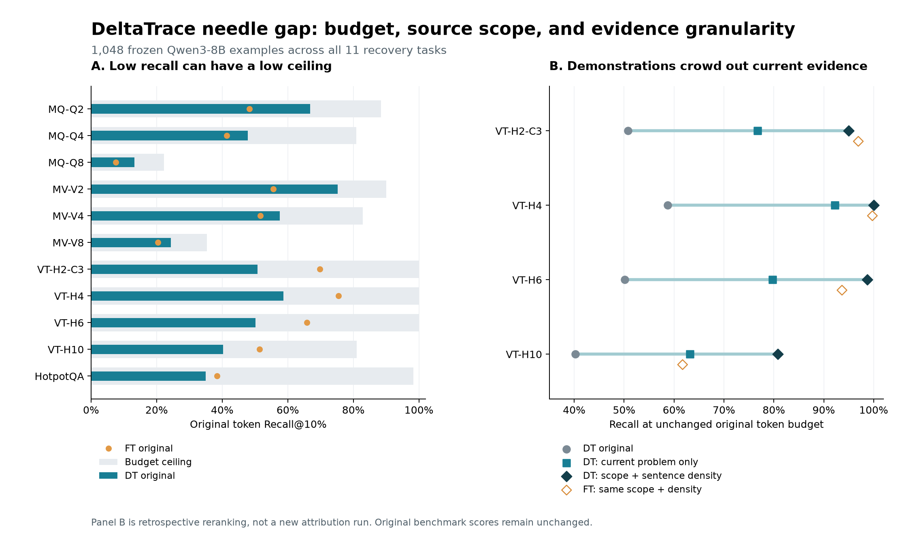

# DeltaTrace needle 跨数据集差距：可验证原因与修复

结论：**主要差距来自固定预算、示例/题目/格式说明占用检索名额，以及整句 gold 与稀疏 token 归因的粒度差异。现有证据不支持先修改有限传播 kernel 或统一改成绝对值排名。**

本轮从 `main@2f80c06` 新建干净工作树 `DeltaTrace-needle-gap-audit`，分支 `codex/needle-gap-audit`。未复制主工作树的未提交文件。归因结果读取冻结版本 `9c6497c08ac3ffa57a40189291644e5a6b99ee36` 的 Qwen3-8B 全量结果；主工作树与既有论文分支均不改。

分析覆盖 **11 个有 recovery 标注的任务、1,048 例**。MATH、MoreHopQA 不具有该指标。按当前冻结记录，DT 相对发布 FT 是 **6 胜、5 负**，不能把“绝对值低”和“相对 FT 差”混为一组。以下所有百分数均为逐例指标的任务均值。

最能解释“跨任务相对表现反转”的证据是：**NIAH 中 FT 给问题/答案前缀的名额更多，VT 中 DT 给已解示例的名额更多。** 同样限制两种方法的检索来源后，NIAH 的 DT 平均优势减少 **78.97%**，VT 的 DT 平均劣势减少 **89.71%**。这表明高低分化的大头与非证据来源竞争有关；这些是固定向量上的检索机制证据，尚不是对模型内部传播机制的完整因果定位。



## 1. 完整原始结果与可达上限

原指标先过滤 stop tokens，再取前 `k=ceil(0.1*N)` 个候选，分母是过滤后的整段 gold token 数 `G`。因此

`Recall = hit/G`，`Recall_ceiling = min(1,k/G)`。

这个上限与模型和归因方法无关。原作者实现见 [evaluate_attr_recovery_skip_tokens](https://github.com/wbopan/flashtrace/blob/075e7e44ae4d5acd2ed76e0d2aced57107d02736/ft_ifr_improve.py#L206-L265)。这里的 needle 是**证据 token 恢复率**，并非模型生成正确答案的成功率。

| 任务 | DT 原始 | FT 原始 | 可达上限 | DT / 上限，逐例归一后平均 |
| --- | ---: | ---: | ---: | ---: |
| MQ-Q2 | 66.76% | 48.34% | 88.41% | 73.00% |
| MQ-Q4 | 47.83% | 41.33% | 80.89% | 58.24% |
| MQ-Q8 | 13.24% | 7.50% | **22.27%** | 59.80% |
| MV-V2 | 75.16% | 55.56% | 89.98% | 81.48% |
| MV-V4 | 57.52% | 51.59% | 82.84% | 68.99% |
| MV-V8 | 24.32% | 20.36% | **35.29%** | 65.64% |
| VT-H2-C3 | 50.74% | 69.76% | 100.00% | 50.74% |
| VT-H4-C1 | 58.71% | 75.48% | 100.00% | 58.71% |
| VT-H6-C1 | 50.15% | 65.85% | 100.00% | 50.15% |
| VT-H10-C1 | 40.24% | 51.42% | 81.06% | 49.63% |
| HotpotQA | 34.91% | 38.37% | 98.28% | 35.41% |

MQ-Q8 平均只有 346.77 个候选，gold 却有 158.19 个；MV-V8 分别为 538.43、155.44。不是仅仅增加需要检索的数量：发布缓存的实际候选长度也变了。因此不能把 Q2→Q8 的原始百分数下降直接解释为能力下降。

也不能反过来用归一化掩盖问题。MQ-Q8 的随机排序期望是 **10.14%**，原 DT 的 13.24% 仅高 **3.10 点**。将随机水平一并扣除，逐例计算 `(Recall-random)/(ceiling-random)` 后，MQ-Q2/Q4/Q8 的 DT 均值是 **69.09/50.07/20.78%**；这说明原始排序在 Q8 上仍有明显的证据区分问题。预算上限、超随机提升和实际检索任务应一起看。

以任务均值 `R=C*E`、`E=mean(R)/mean(C)` 做对称二因子恒等分解，MQ-Q2→Q8 的 53.52 个百分点差距中，44.62 点对应上限变化，即 **83.38%**；MV-V2→V8 的 50.84 点中，41.69 点对应上限变化，即 **82.00%**。这是描述性代数分解，不是对模型因果效应的估计。仍有约 9 点的效率分量，不能声称上限解释了全部失败。

修复：保留原 Recall@10%，并列报告逐例上限、`Recall/ceiling`、precision、5/10/20/30/50% 预算曲线。新代码已实现这些诊断中的核心项。不能用 gold 长度自适应增大实际检索预算来冒充方法提升；等 gold 数预算仅作为已明确标注的诊断列。详见 [task_diagnostics.csv](task_diagnostics.csv)、[findings.json](findings.json)。

## 2. VT 的主要相对劣势来自已解示例占用名额

VT prompt 含一个完整已解示例，之后才是当前问题。原 gold 只覆盖当前问题的变量赋值语句，而 DT 的基线会把**全部候选来源 token** 替换为 EOS，包括示例，目标又是完整响应的 log-likelihood 差。示例能解释格式和措辞，因此获得分数在这一目标下并不矛盾，但它挤占了当前问题证据的检索预算。

代码证据：[`evaluate.py`](../../../experiments/official/evaluate.py) 的 `base[0, eligible] = eos`；[`qwen_signed_secant_vendor_fa.py`](../../../deltatrace/clean/qwen3/qwen_signed_secant_vendor_fa.py) 对完整 target 构造 seed。FT 的 Seq Attr 也聚合完整响应，各行另有归一化；不能简单归因为“DT 看推理、FT 只看答案”。FT 原聚合见 [get_all_token_attrs](https://github.com/wbopan/flashtrace/blob/075e7e44ae4d5acd2ed76e0d2aced57107d02736/llm_attr.py#L374-L408)。

| 任务 | DT 名额落在示例 | FT 名额落在示例 | 原 DT → 仅限当前问题 | 原 FT → 同样限当前问题 |
| --- | ---: | ---: | ---: | ---: |
| VT-H2-C3 | 41.13% | 22.57% | 50.74 → **76.69%** | 69.76 → 80.04% |
| VT-H4-C1 | 52.12% | 27.61% | 58.71 → **92.23%** | 75.48 → 93.88% |
| VT-H6-C1 | 46.35% | 24.40% | 50.15 → **79.72%** | 65.85 → 82.13% |
| VT-H10-C1 | 43.33% | 19.07% | 40.24 → **63.22%** | 51.42 → 62.25% |

干预只删掉排名中已解示例的候选，**保持原 k 不变**，不重算归因、不读 gold 来选边界。边界由 prompt 中第二次出现的任务说明确定。DT 的 400 例 VT 全部提升；四任务与 FT 的平均差距由 **15.67 点缩小到 1.61 点，减少 89.71%**。这是对“名额被占用”的直接排名干预证据，不证明模型内部的注意力或中间状态发生了什么。

必须区分预算：如果改成“当前问题候选数的 10%”，k 会缩小，DT 四项是 43.90/60.25/46.28/34.46%。不能把不同分母混报成统一改善。原预算与重算预算均保存在 [structure_cases.csv](structure_cases.csv)。

修复：对于应用中的当前问题证据检索，显式传递允许检索的来源区间，token 预算单独声明。已提供 `restrict_order_to_span`，其接口只有已有排名、offset 和来源边界，不接收 gold 或答案。若要修复**归因目标本身**，应新跑“保留示例和题目，只对实际证据区做 reference 替换”的配对实验；这会改变解释的干预对象，不能直接从现有向量推断效果。

### 同一来源竞争也解释了 NIAH 的剩余差距

后续检查发现，MQ-Q8 的 DT 前 k 中 **26.99%** 在末尾问题/答案前缀，另 **12.97%** 在开头说明。这些内容能帮助预测完整响应的措辞，却不是被检索的证据段。FT 的问题区占用更高，为 **57.40%**，说明这一问题同时影响两种方法。

针对六个 NIAH 任务，再做一次独立的范围干预：仅保留固定说明后的正文，截止于末尾 `What are all the special magic numbers for ...` 问题之前，仍使用原 k。边界来自发布 prompt 的固定格式，不使用 needle 跨度、数值或 key。600 例均验证 gold 落在解析出的来源区内。

| 任务 | 原 DT → 仅正文 | 原 FT → 同样仅正文 |
| --- | ---: | ---: |
| MQ-Q2 | 66.76 → **86.24%** | 48.34 → 80.32% |
| MQ-Q4 | 47.83 → **70.72%** | 41.33 → 72.43% |
| MQ-Q8 | 13.24 → **22.09%** | 7.50 → 21.24% |
| MV-V2 | 75.16 → **86.78%** | 55.56 → 80.76% |
| MV-V4 | 57.52 → **72.59%** | 51.59 → 70.73% |
| MV-V8 | 24.32 → **31.98%** | 20.36 → 32.28% |

MQ-Q8 已接近原预算的 **22.27%** 上限。因此它的低绝对值由“上限低”和“非证据来源挤占名额”两个可以分别干预、量化的因素共同构成。显式正文范围是额外的任务结构信息，能降低检索难度；这些数值必须作为有来源范围的独立结果，不能回填原表。去除确定不含 gold 的区域本身使固定预算 recall 单调不降，不能把全部改善案例数当成独立泛化的统计证明。详见 [niah_source_tasks.csv](niah_source_tasks.csv)、[probe_niah_source.py](probe_niah_source.py)。

同时，六任务 DT 相对 FT 的平均优势由 **10.03 点缩小到 2.11 点**，减少 78.97%；MQ-Q4、MV-V8 在同样仅正文的条件下 FT 略高。应把这项反向证据与 VT 的修复结果一起报告，不能只选择对 DT 有利的处理结果。

## 3. 整句标注与 token 排名的粒度不匹配

DT 对四个 VT 任务的 **每条 gold 语句均至少命中一个 token，覆盖率全部为 100%**；gold 中被标为答案的变量名 token 恢复率分别为 **86.46/93.86/89.75/84.49%**。但其余语句 token 的恢复率仅为 **33.44/41.21/30.30/17.88%**。其余部分也含右端变量和关系，并不全是无关格式词。因此“needle 低”并不等于没定位到这些变量或赋值语句，也不能凭左端变量命中就宣称完整恢复了关系。

HotpotQA 的 gold 是支持事实的整句话，DT 命中至少一个 token 的 gold 句占 **97.22%**，整句 token Recall 却只有 34.91%。这是粒度差异的实测证据；一条语句命中一个词当然也不等于证明恢复了该语句的全部语义。原始字符跨度与 tokenizer offset 已在 1,048 例上逐一重建并精确核对，见 [span_diagnostics.csv](span_diagnostics.csv) 与 [token_examples.json](token_examples.json)。

固定一个不使用 gold、答案或任务名称的候选：按换行或句末标点分段，以段内候选 token 的**正归因平均值**排序，同段内按原 token 分数及位置打破并列。它返回检索排名，不返回新的 conserved attribution。

| 任务 | 原 DT | DT 来源限制 + 句密度 | FT 同样来源限制 + 句密度 |
| --- | ---: | ---: | ---: |
| VT-H2-C3 | 50.74% | **95.01%** | 96.92% |
| VT-H4-C1 | 58.71% | **100.00%** | 99.74% |
| VT-H6-C1 | 50.15% | **98.70%** | 93.65% |
| VT-H10-C1 | 40.24% | **80.75%** | 61.71% |
| HotpotQA，无示例区间限制 | 34.91% | **61.05%** | 60.93% |

VT 两个简单规则组合后的 400 例全部高于原 DT；HotpotQA 43 例提升、5 例下降，平均增加 **26.15 点**，逐例配对 bootstrap 95% 区间 **[19.96,32.34] 点**。奇偶索引两半均保留提升，但本轮是同一已有数据集上的回顾分析，不能称为独立未见测试集。

**不采用统一句聚合作为全任务默认修复。** 同一候选在 MQ-Q4、MV-V4、MV-V8 上分别下降 **4.97、4.52、2.29 点**；MQ-Q8 的打乱分数控制也达到 13.33%，接近其句密度结果 13.65%，不能把这里的小涨声称为更好的模型解释。FT 同样池化后的结果全部保留，防止只给 DT 加后处理。候选与失败详情见 [structure_tasks.csv](structure_tasks.csv)。

## 4. 已排查及仍待验证的原因

- **负值截断不是这批 top-10% 差距的原因。** 1,048 例 signed 与 positive 排名的 needle 全部相同，top-k 边界也全部无影响命中数的并列；绝对值候选在 11 个任务均未提高均值。HotpotQA 虽有 21.39% gold token 为负，直接取绝对值仍未解决问题。
- **gold token 错位不是主要原因。** 原 DT、发布 FT 的 keep/gold/user-position 映射逐例一致；独立 tokenizer 重建 gold 完全一致，standalone boundary 不同的 token 与 gold 交集为零。
- **不能用模型生成失败解释这批差距。** 1,048 例缓存的 `judge_response` 均为 True；这是发布数据的判定，未额外重新判题。
- **没有证据支持优先归咎于普遍数值崩坏。** 相对 conservation residual 中位数为 0.0493%，只有 HotpotQA 第 31 例超过 1%（7.84%，绝对残差 0.3683 nats）。保留该异常；小总残差不能证明每个 token 排名正确，也不能排除局部误差。
- **FT 的 hop 标签有来源歧义。** 发布文档说 recovery K=3，而与发布 CSV 逐例精确对应的 trace 目录标为 `ifr_multi_hop_both_n1_*`。本轮只称“发布 FT”，不把标签矛盾当成已证明的性能原因。

核心归因的后续实验优先级：①显式证据来源 reference，保留示例/问题；②与当前完整响应目标配对，比较答案目标或分目标归一化，检查完整推理的自条件化和重复措辞是否分散信用；③只有前两项后仍有系统剩余误差，才检查 P1 交互分配或数值算子。每次须记录新的目标差、signed residual、同输入 FT、所有 11 任务的 Recall 及原 RISE/MAS。上述模型层面候选**本轮未执行**，效果不能预先保证。

## 5. 交付与复现

已实现三项代码：原评测入口增加预算诊断、不改变原 needle；独立 CPU recovery 诊断模块；显式来源过滤与句密度的可选检索排名 API。原冻结方法、attention/kernel、RISE/MAS 评分规则均未修改。9 个针对预算上限、映射、并列、来源和句聚合的测试通过；1,048 例旧分数的兼容核验通过。新增入口的模型执行路径未进行 GPU 回归，本轮 `model_calls=0`。

从工作树根目录运行，以下路径可按本机保存位置调整：

```powershell
# 当前机器的 Python；普通环境可替换为 python。
$auditPython = 'C:\Users\Chen\.cache\codex-runtimes\codex-primary-runtime\dependencies\python\python.exe'

& $auditPython -m unittest discover -s experiments/official -p test_recovery_diagnostics.py -v

& $auditPython -X utf8 research/temporary/needle_gap_20260910/audit_saved.py `
  --publication ../DeltaTrace-paper-qwen3/experiments/official/results/qwen3_8b_table1_20260909 `
  --data ../audit/published_flashtrace/table1-data-v1/extracted/data `
  --traces ../audit/published_flashtrace/table1-data-v1/traces/traces/exp/exp2/data

& $auditPython -m pip install --target research/temporary/needle_gap_20260910/.deps --no-deps tokenizers==0.22.2
& $auditPython -X utf8 research/temporary/needle_gap_20260910/structure_saved.py `
  --publication ../DeltaTrace-paper-qwen3/experiments/official/results/qwen3_8b_table1_20260909 `
  --data ../audit/published_flashtrace/table1-data-v1/extracted/data `
  --traces ../audit/published_flashtrace/table1-data-v1/traces/traces/exp/exp2/data `
  --tokenizer ../audit/deltatrace-figures-20260909/qwen3-tokenizer.json

& $auditPython -X utf8 research/temporary/needle_gap_20260910/probe_niah_source.py `
  --publication ../DeltaTrace-paper-qwen3/experiments/official/results/qwen3_8b_table1_20260909 `
  --data ../audit/published_flashtrace/table1-data-v1/extracted/data `
  --traces ../audit/published_flashtrace/table1-data-v1/traces/traces/exp/exp2/data `
  --tokenizer ../audit/deltatrace-figures-20260909/qwen3-tokenizer.json

# 使用本机已有 numpy/matplotlib，或在普通环境安装 numpy、matplotlib 后直接运行。
$env:PYTHONPATH = (Resolve-Path ../audit/plot_dependencies).Path
& $auditPython -X utf8 research/temporary/needle_gap_20260910/build_findings.py
```

[source_receipt.json](source_receipt.json) 保存缓存、DT 原始压缩结果、归因向量、逐例 FT trace 的 SHA-256；[structure_receipt.json](structure_receipt.json) 保存 tokenizer 与候选源码身份。[protocol.md](protocol.md) 区分最初固定候选和后续范围干预，所有原始任务及失败结果均已保留。公开原始数据协议见 [FlashTrace table1-data-v1](https://github.com/wbopan/flashtrace/releases/tag/table1-data-v1)。
