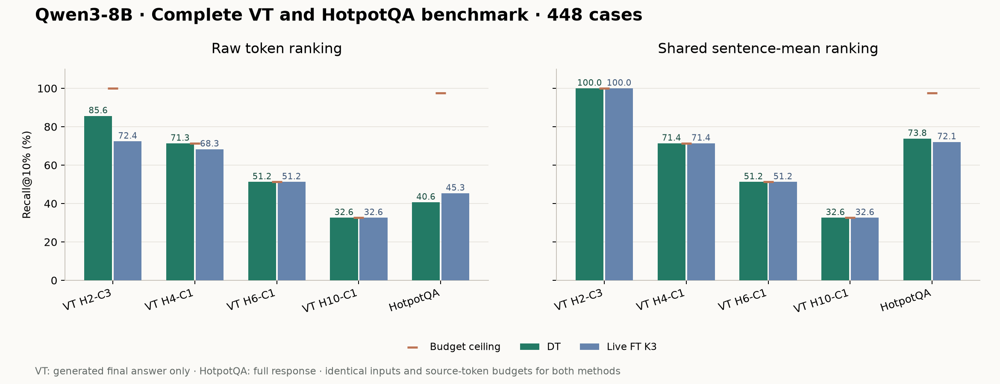

# VT 与 HotpotQA 全量 Recall 表

**Qwen3-8B，448/448 例已完整覆盖并复核**：四组 VT 各 100 例，HotpotQA 48 例。复用完全同协议、已独立验证的 80 例，新增 368 例；额外重跑 5 个衔接控制，其 15 份 DT/FT 向量逐位一致，控制不重复计入样本数。

固定目标：VT 只解释缓存中模型生成的最终答案；HotpotQA 解释完整回答。DT 与 live FT K3 使用相同模型输入、目标 token、正文候选集和 `ceil(0.10*N_source)` token 预算。DT 保留原 content-P1 规则与原 EOS 参照。原始 token 排序和双方同样的句均值聚合同时报告。



## Recall@10% 全表

| 数据集 | n | DT 原始 | FT K3 原始 | DT 句均值 | FT K3 句均值 | 预算 Recall 上限 |
| --- | ---: | ---: | ---: | ---: | ---: | ---: |
| VT H2-C3 | 100 | 85.62% | 72.41% | 100.00% | 100.00% | 100.00% |
| VT H4-C1 | 100 | 71.33% | 68.32% | 71.37% | 71.37% | 71.37% |
| VT H6-C1 | 100 | 51.23% | 51.23% | 51.23% | 51.23% | 51.23% |
| VT H10-C1 | 100 | 32.61% | 32.61% | 32.61% | 32.61% | 32.61% |
| HotpotQA | 48 | 40.63% | 45.35% | 73.81% | 72.09% | 97.48% |
| VT 宏平均 | 400 | 60.20% | 56.14% | 63.80% | 63.80% | 63.80% |
| 五任务宏平均 | 448 | 56.28% | 53.98% | 65.80% | 65.46% | 70.54% |

宏平均按任务等权，n 为覆盖的样本总数。句聚合仍按 token 收费，未按整句免费补齐；预算上限由每例有效 gold 数和 token 预算计算。

## 每任务配对差值（DT−FT K3，百分点）

| 数据集 | 原始差值 | 描述性 95% 区间 | 句均值差值 | 描述性 95% 区间 |
| --- | ---: | --- | ---: | --- |
| VT H2-C3 | +13.21 | [+11.82, +14.55] | +0.00 | [+0.00, +0.00] |
| VT H4-C1 | +3.01 | [+2.54, +3.48] | +0.00 | [+0.00, +0.00] |
| VT H6-C1 | +0.00 | [+0.00, +0.00] | +0.00 | [+0.00, +0.00] |
| VT H10-C1 | +0.00 | [+0.00, +0.00] | +0.00 | [+0.00, +0.00] |
| HotpotQA | -4.71 | [-7.64, -1.87] | +1.73 | [-4.73, +7.97] |

## 总体配对区间

| 范围 | 原始差值 | 描述性调整区间 | 句均值差值 | 描述性调整区间 |
| --- | ---: | --- | ---: | --- |
| VT | +4.05 | [+3.59, +4.51] | +0.00 | [+0.00, +0.00] |
| HotpotQA | -4.71 | [-8.60, -1.07] | +1.73 | [-6.54, +9.48] |

**这张表包含开发样本及先前验证样本，是完整基准结果，不是另一轮独立留出验证。** 区间由 10,000 次任务内配对 bootstrap 得到；总体四项比较使用 Bonferroni 98.75% 区间，仅作完整数据的描述。独立性更强的先前保留验证及其预定结论单独保留，不用全量结果重新选择目标或排序。

## 次要预算与 FT K1

[多预算完整表](table_budgets.csv) 包含每个任务及宏平均的 5%、10%、20% 两种排序、DT、FT K1、FT K3、差值和区间。

## 复核与复现

- 样本覆盖精确等于发布缓存的全部索引；无漏例、重复计数或目标策略混用。
- 已验证每个新增样本的原 prompt、gold、答案提取、EOS 参照、实际 DT/FT 目标权重与 FT 可用多跳范围，并从原始向量重算所有 Recall。80 例复用数据通过冻结的结果、向量及先前独立分析哈希绑定。
- 每个任务的衔接控制均通过原始输入与三份向量的逐位一致检查；正式方法的 27 项冻结依赖不变。
- 本次新增模型操作用时合计 1445.27 秒，含分批加载和衔接控制；复用数据对应此前模型操作 267.15 秒。实际逐操作成本及额外原目标控制保留。

[Recall@10% CSV](table_recall10.csv) · [逐例表](per_case.csv) · [样本来源](case_origins.csv) · [完整分析](analysis.json) · [固定全量计划](../FULL_RECALL.md) · [先前 80 例保留验证](../target_scope/RESULTS.md) · [目标构造修复说明](../TARGET_CONSTRUCTION_FIX.md)

原始数据见 [全量新增批次清单](../raw/full_recall_v1/manifest.json) 和 [复用 80 例清单](../raw/target_scope_v1/manifest.json)。两者均保存确定性 gzip 和原始字节哈希，可用 `archive_results.py --restore` 分别恢复到新目录，再运行以下命令：

```bash
python research/temporary/source_v2_gpu_20260910/analyze_full_recall.py \
  --run /path/restored-full --parent /path/restored-parent \
  --publication /path/original-publication --data /path/original-data \
  --tokenizer /path/qwen3-tokenizer.json --output /path/rechecked-full
python research/temporary/source_v2_gpu_20260910/build_full_recall_report.py \
  --analysis /path/rechecked-full/analysis.json --plot
```
