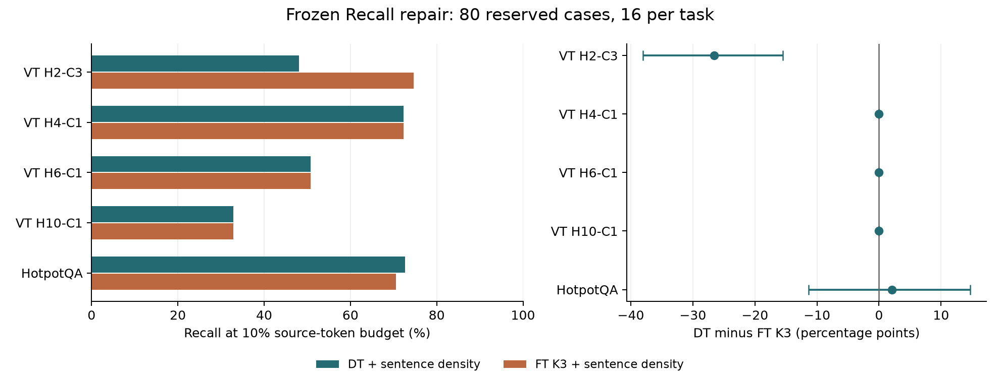

# VT 与 HotpotQA：Recall 小样本修复验证

固定方案：**原 full-prompt reference + 正分数句内均值排序**。句子排序后仍只取正文候选 token 的 10%，DT 与 live FT K3 使用完全相同的来源、聚合规则和 token 预算。没有扩大 k，也没有用 gold 定义候选句。

16 例开发选择方案后固定；80 例留出验证，每个任务 16 例。验证集来自此前审计过的发布缓存，不是外部新数据集。

| 验证任务 | DT 原 token 排序 | DT 句聚合 | FT K3 同样句聚合 | DT−FT，百分点 [95% CI] |
| --- | ---: | ---: | ---: | ---: |
| VT H2-C3 | 41.37% | 48.11% | 74.67% | -26.56 [-38.00, -15.51] |
| VT H4-C1 | 72.12% | 72.26% | 72.26% | +0.00 [+0.00, +0.00] |
| VT H6-C1 | 50.79% | 50.79% | 50.79% | +0.00 [+0.00, +0.00] |
| VT H10-C1 | 32.90% | 32.90% | 32.90% | +0.00 [+0.00, +0.00] |
| HotpotQA | 42.94% | 72.63% | 70.53% | +2.10 [-11.38, +14.67] |

| 汇总（任务等权） | DT | FT K3 | 差值，百分点 [95% CI] |
| --- | ---: | ---: | ---: |
| VT | 51.02% | 57.66% | -6.64 [-9.50, -3.88] |
| HotpotQA | 72.63% | 70.53% | +2.10 [-11.38, +14.67] |
| all_five_tasks | 55.34% | 60.23% | -4.89 [-8.35, -1.50] |

**预定的共同优势判据：未达到。**要求 VT 与 HotpotQA 的均值均优于 FT，并且五任务等权差值的 95% 区间下界大于 0。单任务或分组区间跨 0 时不宣称该任务已建立可靠优势。

## 原因与被排除的修复

- 原始检索范围会让示例、题目和格式占用名额。显式限定正文能消除这项竞争；固定 token 预算与可达上限必须同时记录。
- 保留正文外内容的 EOS reference 并未修好 Recall：完整 VT H4-C1 100 例下降 4.55 点，HotpotQA 48 例下降 8.69 点。因此本方案保留原 reference，仅修复检索排序。
- DT 常给支持句中的少数词高分，而 gold 覆盖整句话。句内均值把这些信号用于支持句排序；FT 同样受益，表中比较已经给 FT 相同处理。
- 开发集的端点反向和两方向平均均未胜过原方向。原生半精度模型在部分交换批次后还有数值差异（最大目标差不对称 0.480 nats），因此该诊断也不能被当成仅改变交互公式的无混杂因果实验。最终方案不使用这些变体。

## 预算敏感性

| 等权汇总 | Recall@5% 差值 | Recall@10% 差值 | Recall@20% 差值 |
| --- | ---: | ---: | ---: |
| VT | -6.13 [-8.77, -3.56] | -6.64 [-9.50, -3.88] | -3.85 [-6.45, -1.48] |
| HotpotQA | -15.41 [-25.39, -5.95] | +2.10 [-11.38, +14.67] | +5.47 [-1.92, +13.32] |
| all_five_tasks | -7.99 [-10.89, -5.18] | -4.89 [-8.35, -1.50] | -1.99 [-4.54, +0.47] |

区间为逐任务独立、逐例配对 bootstrap（10,000 次，seed 73）。5% 和 20% 是预定敏感性分析，不能替换 10% 主结果。句聚合是检索规则，不改变 signed attribution 或声称新的 conservation。

## 可复核记录

- [固定实验计划](../RECALL_PILOT.md)、[开发集预算上限修正](../RECALL_CEILING_ADDENDUM.md)、[预先固定的样本](../recall_split.json)。
- [全部开发候选](../recall_development/analysis.json)、[验证前固定的方案](../recall_development/choice.json)、[开发对照向量复现检查](../recall_development/control_verification.json)。
- [验证分析与区间](analysis.json)、[逐例结果](cases.csv)。两种方法的输入、目标、范围、reference、向量与 Recall 已独立重建核对。
- 本次验证的已完成模型操作累计 402.60 秒，另计开发与此前被中断的全量实验。
