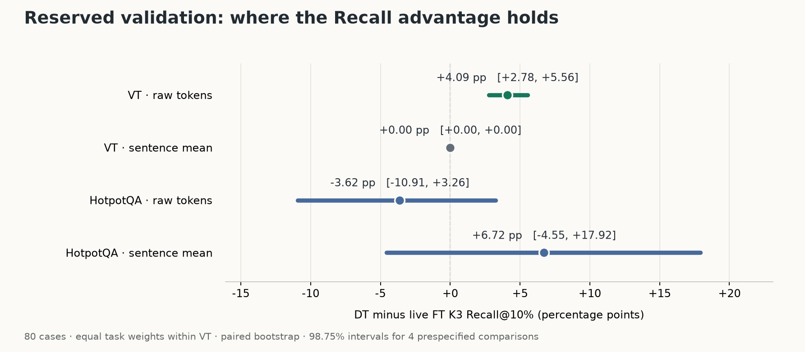

# 80 例保留验证：解释目标修复与 Recall 的适用范围

使用运行前冻结的任务设置：VT 只解释生成的最终答案，HotpotQA 解释完整回答。两种方法在每个任务内使用相同原始模型输入、非停止目标 token、正文候选集和 `ceil(0.10*N_source)` token 预算；DT 使用原 EOS 参照与原 content-P1 规则，FT K3 live 执行。

这是任务特定的解释目标预设。它没有通过或替代此前失败的统一目标门槛。第二组 80 例在选择该预设时封存，均已完成后才进行结果分析；属于已审计基准的内部保留验证。

## 四项预定主比较

VT 为四个任务等权均值。区间是 10,000 次任务内配对 bootstrap 的 Bonferroni 调整区间：每项覆盖率 98.75%，四项名义联合覆盖率 95%。单个任务和其他预算只作次要分析。

| 范围及排序 | DT Recall | FT K3 Recall | DT−FT（百分点） | 调整后区间 | 判定 |
| --- | ---: | ---: | ---: | --- | --- |
| VT · raw tokens | 59.79% | 55.70% | +4.09 | [+2.78, +5.56] | 确认优势 |
| VT · sentence mean | 63.58% | 63.58% | +0.00 | [+0.00, +0.00] | 共同达到预算上限，持平 |
| HotpotQA · raw tokens | 40.07% | 43.68% | -3.62 | [-10.91, +3.26] | 不确定 |
| HotpotQA · sentence mean | 75.94% | 69.22% | +6.72 | [-4.55, +17.92] | 不确定 |

原始 token 排序的优势只说明该视图下的差异。句聚合为两种方法共同提供，必须同时查看其结果；不能把共同预算上限持平解释成 DT 超过 FT。

## 全部五个任务

| 任务（各 16 例） | 原始 DT | 原始 FT K3 | 句均值 DT | 句均值 FT K3 | 10% 预算 Recall 上限 |
| --- | ---: | ---: | ---: | ---: | ---: |
| VT H2-C3 | 84.85% | 71.27% | 100.00% | 100.00% | 100.00% |
| VT H4-C1 | 70.88% | 68.11% | 70.88% | 70.88% | 70.88% |
| VT H6-C1 | 50.84% | 50.84% | 50.84% | 50.84% | 50.84% |
| VT H10-C1 | 32.60% | 32.60% | 32.60% | 32.60% | 32.60% |
| HotpotQA | 40.07% | 43.68% | 75.94% | 69.22% | 95.74% |

## 可论证的修复与限制

- 多链 VT 的完整响应包含未被提问的其他链，而 gold 只覆盖被问到的链。开发对照证明：仅限制最终答案种子不足，移除已生成推理后才恢复到双方 100% 的句聚合 Recall。这改变了解释目标，不能称为模型能力提高。
- 正文候选过滤与句聚合是独立检索步骤。两者都同等给予 FT；句聚合仍严格支付 token 预算，原始 signed DT 向量单独保存。
- HotpotQA 保留完整回答是开发集选择。桥接上下文是可能的解释，尚未用独立机制消融证明。其优势范围以本表为准。
- 所有先前失败保留：正文 reference 的两项完整任务负结果、首轮 80 例验证、目标/参照/聚合/逐层对称开发实验。第二组验证后不再在这 80 例上选择其他候选。
- 单个 VT 任务与 5%/20% 预算的区间仅作次要分析；不把其中的正值改称预定主检验成功。

## 预算敏感性（次要）

| 范围及排序 | 5% DT−FT | 10% DT−FT | 20% DT−FT |
| --- | ---: | ---: | ---: |
| VT · raw tokens | +0.23 | +4.09 | +2.81 |
| VT · sentence mean | +0.00 | +0.00 | +0.00 |
| HotpotQA · raw tokens | -4.81 | -3.62 | -2.35 |
| HotpotQA · sentence mean | +0.08 | +6.72 | +9.54 |

## 复核记录

80 例输入、原 prompt、gold、答案子串、完整参照和实际 DT/FT 目标权重全部核对；全部 Recall 曲线从保存向量重算。运行前已冻结代码、计划、样本与目标策略，27 项正式方法依赖未改写。

模型操作总时间 267.15 秒，包含加载、额外完整响应控制与两种 FT 配置；逐操作时间和归因数值残差保留在分析文件中。

[逐例结果](cases.csv) · [完整分析和执行成本](analysis.json) · [预定设计](../TARGET_SCOPE_VALIDATION.md) · [冻结目标策略](../scope_choice.json) · [先前开发结果](../answer_development/RESULTS.md)

结果 SHA-256：`b4f39e9b58ca5631db2a509f02b93476ba08a2425ea711c70ed51570f48639a1`。向量 SHA-256：`0e145ecd1304bfe0bda1662c2b76e55ebbbf8a0066d1619cc066e4e4db3bd43e`。
